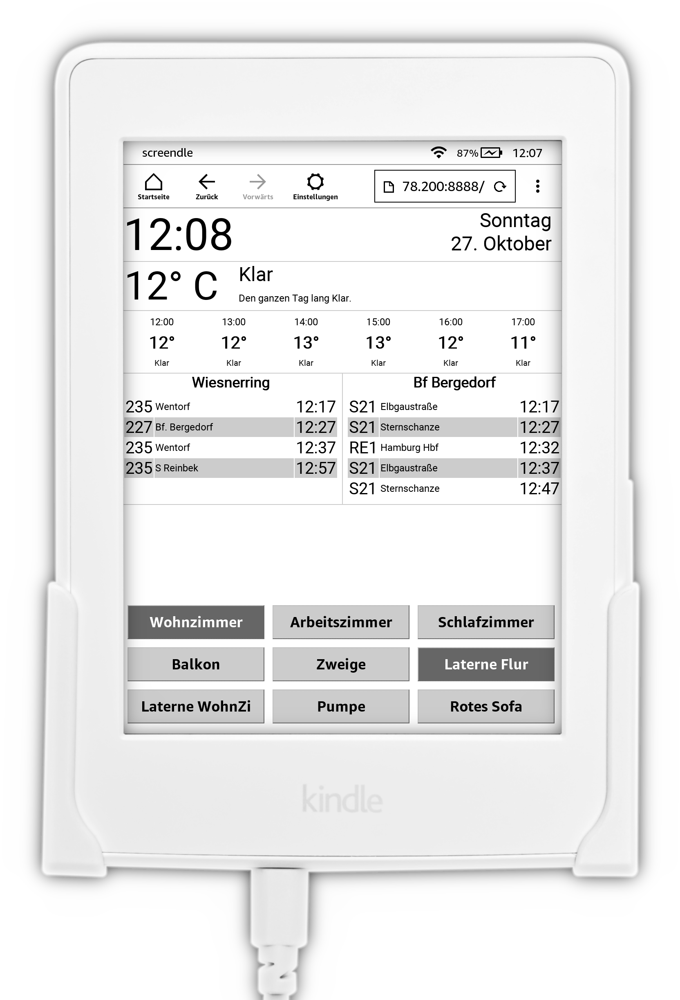

# screendle

screendle turns the Kindle Paperwhite E-Book-Reader into an info screen and Smart Home control center.

It is a simple web application written in node.js with a frontend that is optimized for the Kindle Paperwhite Experimental Browser.



## Who is this project useful for?
I built this for myself, so it is in no way polished for a broad audience.

People who meet the following criteria can use *screendle* pretty much as-is:

* Own a Kindle Paperwhite
* Own a Philips Hue System
* Can edit basic JavaScript Code
* Can set up a node.js Server on their network
* Live in Hamburg, Germany

Everybody else may or may not find the code useful as inspiration.

## Features

* Time, Date and Weekday
* Current Weather + Forecast
* Next Departures of Busses and Trains for Hamburg, Germany
* List of Rooms from Philips Hue + ability to switch them on or off

## Server Setup

node.js is required in version 9 or later.

After editing the `config.js` file (see below), run the following command to start the server:

```
npm start
```

By default, the server will listen on Port 80. A different port can be used by setting the environment variable `NODE_PORT`:

```
NODE_PORT=8888 npm start
```

Once the server is up and running, the web interface can be accessed by any browser by using the IP Address of the server (or localhost).

### Raspberry Pi
The server does not need many resources and runs well on a *Raspberry Pi* once a recent version of [node.js for ARM](https://nodejs.org/en/download/) has been installed.

### Docker (development)
Node and npm can be run in docker.

#### Install dependencies

bash:
```
docker run --rm -it -w /app -v $(PWD):/app -p 8888:80 node:9.8-alpine npm install
```
PowerShell:
```
docker run --rm -it -w /app -v ${PWD}:/app -p 8888:80 node:9.8-alpine npm install
```

#### Unit Tests

bash:
```
docker run --rm -it -w /app -v $(PWD):/app node:9.8-alpine npm run-script test
```
PowerShell:
```
docker run --rm -it -w /app -v ${PWD}:/app node:9.8-alpine npm run-script test
```

#### Run a development server via [nodemon](https://nodemon.io)

bash:
```
docker run --rm -it -w /app -v $(PWD):/app -p 8888:80 node:9.8-alpine npx nodemon server
```
PowerShell:
```
docker run --rm -it -w /app -v ${PWD}:/app -p 8888:80 node:9.8-alpine npx nodemon --legacy-watch server
```

### Docker (production)
A Container can be built with the included Dockerfile.

### Security Notice
If the screendle server is running on a network, anyone who has access to that network and finds the web interface can use it to turn the connected Hue lights on or off.

## Configuration
Copy the file `config.dist.js` and name the copy `config.js`. Edit the file according to the following sections.

### Time
Running the Kindle Paperwhite with the screen saver disabled and the Browser open all the time (see *Kindle Setup*) seems to prevent the internal clock from correcting itself.

To work around this issue, *screendle* periodically synchronizes the time it displays with the server side time, based on the assumption that an [NTP Daemon](https://en.wikipedia.org/wiki/Ntpd) is running on the server.

Only the timezone needs to be set in the configuration:

```
    TIME: {
        TIMEZONE: 'UTC',
    }
```

The values for the timezone settings are based on the [tz database](https://en.wikipedia.org/wiki/Tz_database), which is used on most servers and browsers.

Wikipedia has a [List of tz database time zones](https://en.wikipedia.org/wiki/List_of_tz_database_time_zones) - relevant values are in the column `TZ database name`.

### Philips Hue
To get a list of rooms configured in a Philips Hue Bridge and to be able to switch rooms on or off, *screendle* needs API Credentials for the Hue Brige.

Getting API Credentials for a Philips Hue Bridge involves multiple steps.

1. T he IP Address of the Philips Hue Bridge is needed. It can be obtained by visiting [https://www.meethue.com/api/nupnp](https://www.meethue.com/api/nupnp), which should return a JSON document similar to this example:

    ```
    [{"id":"000000fffffff000","internalipaddress":"192.168.178.196"}]
    ```

    The value of the `internalipaddress`, (in the example above `192.168.178.196`) is the IP Address of the Bridge.

2. Using this IP Address, an API Debug Tool can be accessed by visiting `http://IP-ADDRESS/debug/clip.html`.

    To get an API User, the Debug Tool needs to be configured as follows:

    * `URL` must be set to `/api`.
    * `Message Body` must be set to:
        ```
        {"devicetype":"screendle"}
        ```
        (The value of the devicetype does not have to be `screendle`, it can be freely chosen)

3. The big round button on the (physical) Hue Bridge must be pushed.

4. As soon as possible after that, the request from the debug tool must be sent by clicking the `POST` Button.

    The `Command Response` field should be filled with a value similar to the following:
    ```
    [
        {
            "success": {
                "username": "YOURUSERNAMEISHERE"
            }
        }
    ]
    ```

The IP Address of the Bridge and the username can now be added to the configuration as BRIDGE_HOST and API_USER:
```
    HUE: {
        BRIDGE_HOST: '192.168.178.196',
        API_USER: 'YOURUSERNAMEISHERE',
    },
```

### Darksky Weather
Weather Data can be fetched from [Dark Sky](https://darksky.net/). All you need is an API Key. You can get one by signing up for a Dark Sky developer account at [https://darksky.net/dev](https://darksky.net/dev).

You'll also need the coordinates for which you want the weather forecast. A good website to obtain these is [LatLong.net](https://www.latlong.net/).

With these, you can configure the Dark Sky section:
```
    DARKSKY: {
        API_KEY: 'your-api-key',
        LANGUAGE: 'de',
        UNITS: 'si',
        LAT: 53.53,
        LON: 10.0,
    },
```

You can also customize the language of the forecast or change the unit system (for example use `us` for Imperial Units instead of SI Units). Valid values can be found in the [Dark Sky API Documentation](https://darksky.net/dev/docs).

### HVV Busses and Trains
[HVV](https://www.hvv.de/en) is the public transport association in Hamburg, Germany. They provide the option to configure a departure widget on their website, which can be used on personal screens or web sites.

*screendle* displays 2 of these widgets, one for busses and one for trains, next to each other.

The widgets can be configured at  [abfahrten.hvv.de](https://abfahrten.hvv.de/) and the resulting URLs can then be used inside the configuration:

```
    HVV_BUSSES: {
        MONITOR_URL: 'https://abfahrten.hvv.de/00000000-1111-2222-3333-444444444444',
    },

    HVV_TRAINS: {
        MONITOR_URL: 'https://abfahrten.hvv.de/aaaaaaaa-bbbb-cccc-dddd-eeeeeeeeeeee',
    }
```

## Kindle Setup

### Kindle Paperwhite Web Browser

The Kindle Paperwhite features a Web Browser, called "Beta Browser" or "Experimental Browser". It can be accessed via the menu button on the top right of the home screen.

Like most browsers, it features a URL input field, where the address of the screendle server can be entered.

### Disabling the Screen Saver

The Kindle Paperwhite normally turns itself off and displays a static image on its display. For an info screen (which may be wall mounted), this is not desirable behavior. Fortunately, it can be deactivated:

1. Go to the Kindle Home Screen
2. Open the Search Bar
3. Enter the command `;debugOn` and press enter
4. Enter the command `~ds` and press enter
5. Enter the command `;debugOff` and press enter

Now, the Browser can be used and the Kindle won't turn itself off.

This procedure must be repeated after the Kindle has been rebooted.

## Disclaimer
This project is a personal pet project and is in no way endorsed by Amazon, Philips or any other commercial entity.
